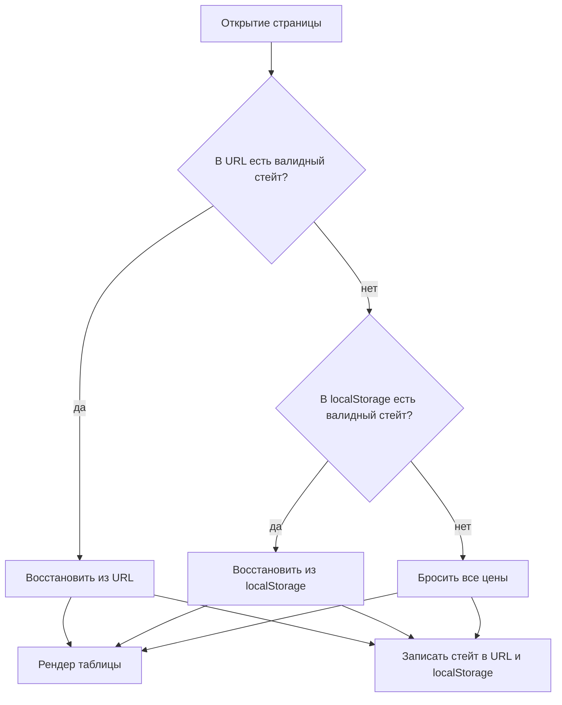
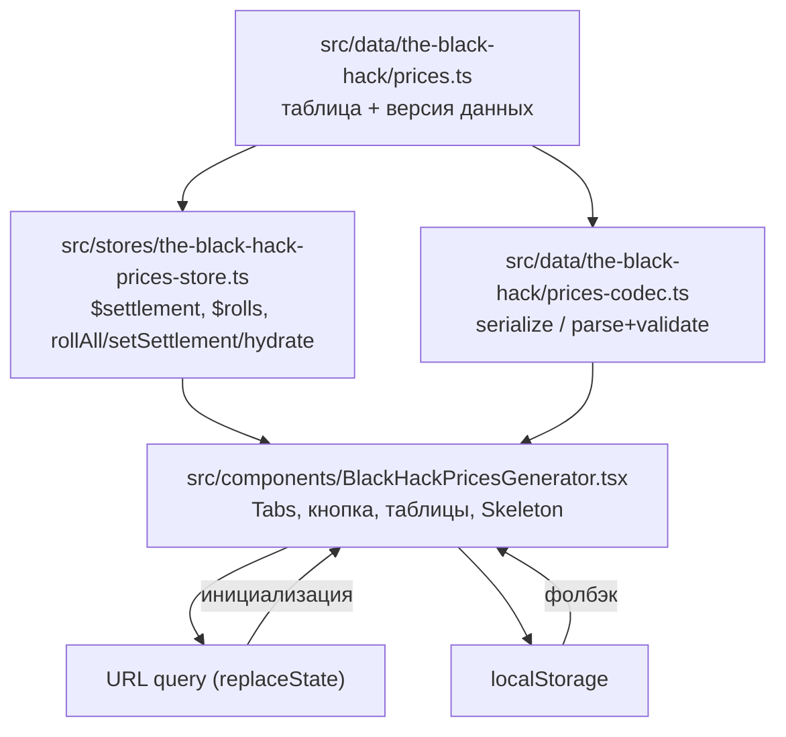

# The Black Hack Prices Page - Plan

## Goal Capsule

- **Objective:** страница `/the-black-hack/prices` — таблица снаряжения с индивидуально выброшенными ценами, воспроизводимыми по URL и восстанавливаемыми из localStorage.
- **Product authority:** Product Contract этого документа; правила экономики — `docs/prices.md`.
- **Execution profile:** кодек и стор — test-first; компонент — тесты презентации по конвенциям репо; страница — smoke через build/typecheck.
- **Stop conditions:** несоответствие Product Contract или конвенций CLAUDE.md — остановиться и спросить; детали, оставленные открытыми, решает исполнитель.
- **Open blockers:** нет.

---

## Product Contract

### Summary

Новая страница для The Black Hack: таблица товаров, где каждый предмет получает собственный бросок цены по формуле своей категории редкости. Тип поселения фильтрует доступные категории. Тип и выпавшие значения синхронизируются в URL и localStorage — та же ссылка всегда показывает те же цены.

### Problem Frame

Правила ЧК советуют фиксировать цены на время пребывания в поселении и перебрасывать только при прибытии в новое место (`docs/prices.md`, «Список снаряжения»). Без инструмента ведущему приходится записывать ~50 бросков вручную. Страница без персистентности бесполезна: перезагрузка теряет цены посреди игровой сессии.

### Key Decisions

- **Тип поселения — только фильтр доступности.** По правилу редкости: обычное доступно везде, редкое — не в сельской местности, экзотическое — только в больших городах. Цены тип не модифицирует — модификаторы были бы хоумрулом.
- **Своя цена на каждый предмет.** Каждый предмет бросается индивидуально по формуле категории, а не одним броском на категорию — ближе к духу правила и полезнее за столом.
- **Смена типа поселения = новое поселение.** Переключение типа перебрасывает все цены целиком; «посмотреть и вернуться» без потери цен не поддерживается.
- **URL кодирует выпавшие значения, не seed.** Seed потребовал бы второго, детерминированного RNG рядом с crypto (`src/lib/dice.ts` не поддерживает seed) и молча менял бы цены по старым ссылкам при любом изменении списка товаров. Хеш не подходит — он необратим.
- **URL приоритетнее localStorage.** Ссылка со стейтом показывает свой стейт независимо от локальной сессии; localStorage — для возврата на голый адрес.

### Requirements

**Данные и генерация**

- R1. Список снаряжения переносится из `docs/prices.md`: три категории редкости — обычное/дешёвое (1к8 монет), редкое/ценное (2к8×5), экзотическое/дорогое (4к8×10). Перевод авторский, аннотации предметов (КИ, ЗБ) сохраняются.
- R2. Каждый предмет получает собственный бросок цены по формуле своей категории.
- R3. Ценовые множители брони (кожаная ×2, кольчужная ×3, латная ×4) применяются к выпавшему значению; таблица показывает итоговую цену.

**Поселение и доступность**

- R4. Три типа поселения: сельская местность, город, большой город.
- R5. Тип определяет видимые категории: обычное — во всех типах; редкое — в городе и большом городе; экзотическое — только в большом городе. Недоступные категории скрыты полностью.
- R6. Смена типа поселения перебрасывает все цены.

**Состояние и синхронизация**

- R7. Тип поселения и все выпавшие значения кодируются в URL компактной обратимой упаковкой; открытие ссылки воспроизводит тот же тип и те же цены.
- R8. Состояние дублируется в localStorage; визит на адрес без параметров восстанавливает последнюю сессию.
- R9. При открытии URL со стейтом он имеет приоритет над localStorage.
- R10. Каждое действие (переброс, смена типа) обновляет и URL, и localStorage.

**Интерфейс**

- R11. Единственное действие генерации — кнопка «перебросить всё» (прибытие в новое место).
- R12. Таблица группирует предметы по категориям редкости и показывает название, аннотации и цену.

### Key Flows

- F1. Первый визит
  - **Trigger:** открыт голый адрес, localStorage пуст.
  - **Steps:** страница бросает цены всех предметов на клиенте; стейт записывается в URL и localStorage.
  - **Outcome:** таблица с ценами, ссылка сразу шареабельна.
- F2. Открытие ссылки со стейтом
  - **Trigger:** URL содержит тип и упакованные значения.
  - **Steps:** стейт парсится из URL, броски не выполняются; localStorage обновляется.
  - **Outcome:** тот же тип поселения и те же цены, что у автора ссылки.
- F3. Возврат на голый адрес
  - **Trigger:** адрес без параметров, localStorage хранит сессию.
  - **Steps:** стейт восстанавливается из localStorage и дописывается в URL.
  - **Outcome:** ведущий продолжает с теми же ценами.
- F4. Переброс или смена типа
  - **Trigger:** кнопка «перебросить всё» или переключение типа поселения.
  - **Steps:** все цены бросаются заново; URL и localStorage обновляются.
  - **Outcome:** новое поселение с новыми ценами.

### Acceptance Examples

- AE1. **Covers R7.** Given выброшенные цены, When URL копируется и открывается в другом браузере, Then показаны тот же тип поселения и те же цены.
- AE2. **Covers R9.** Given localStorage хранит сессию «город», When открывается ссылка со стейтом «большой город», Then показан стейт из ссылки, а localStorage перезаписан им.
- AE3. **Covers R5.** Given тип «сельская местность», When открыта таблица, Then видны только обычные предметы; редкие и экзотические отсутствуют.
- AE4. **Covers R6.** Given выброшенные цены, When тип переключён на другой, Then все цены выброшены заново.

### Scope Boundaries

- Торг (бросок цены с преимуществом/осложнением) — вне скоупа.
- Переброс цены отдельного предмета — вне скоупа.
- Модификаторы цен по типу поселения — хоумрул, вне скоупа.
- Показ недоступных категорий приглушёнными — вне скоупа, категории скрываются.
- Старые ссылки после изменения списка товаров не мигрируются: несовпадение версии данных или длины стейта молча ведёт к фолбэку (localStorage → свежий бросок), без предупреждающего баннера.
- Навигация back/forward по прошлым состояниям — вне скоупа: URL обновляется через `replaceState`, история не копится.

### Dependencies / Assumptions

- `src/lib/dice.ts` — crypto-RNG без seed; воспроизводимость достигается хранением выпавших значений, не повторной генерацией.
- В репо нет прецедента URL- или localStorage-синхронизации — это первая реализация; паттерн станет образцом для остальных инструментов.
- Статический вывод Astro: стейт парсится на клиенте, первый бросок — по существующей useEffect-конвенции; до применения стейта строки закрыты Skeleton.

### Sources / Research

- `docs/prices.md` — категории, формулы цен, множители брони, правило доступности по типу поселения, совет о фиксации цен.
- Проверено по коду: `src/lib/dice.ts` не поддерживает seed и не возвращает отдельные значения кубиков (`rollDice` суммирует); в `src/` нет использования `URLSearchParams`/`window.location`/`localStorage`; `@nanostores/persistent` не в зависимостях.
- Паттерн-образец генератора: `src/data/mausritter/weather.ts` → `src/stores/weather-store.ts` → `src/components/WeatherGenerator.tsx` → `src/pages/mausritter/weather.astro`; селектор — `Tabs` из `src/components/ui/tabs.tsx`, маскировка загрузки — `src/components/ui/skeleton.tsx`.
- Тестовые конвенции: `src/test-utils/mock-crypto.ts` (значение мока задаёт грань напрямую), стор-тесты и компонент-тесты по образцу `weather-store.test.ts` / `WeatherGenerator.test.tsx`.

---

## Planning Contract

Product Contract сохранён без содержательных изменений; deferred-вопросы брейншторма (схема упаковки, стратегия истории, формат localStorage) резолвлены в KTD ниже, их решения отражены в Scope Boundaries.

### Key Technical Decisions

- **KTD1. Кодировка стейта — строка цифр 1–8, по символу на кубик.** Query-параметры: `s` — slug типа поселения (`rural` / `town` / `city`), `v` — версия данных, выводимая из содержимого таблицы (короткий хеш упорядоченного списка предметов, вычисляется при загрузке модуля): любое изменение состава или порядка меняет её автоматически, ручной bump не нужен и забыть его нельзя. `r` — конкатенация граней всех кубиков в порядке предметов таблицы (обычные — 1 кубик, редкие — 2, экзотические — 4). Канонический порядок общий для кодека и стора: категории в порядке объявления таблицы, предметы — в порядке объявления внутри категории, кубики предмета — подряд. Броски и `r` всегда покрывают все предметы всех категорий независимо от типа поселения — тип фильтрует только отображение (R5), не генерацию и не сериализацию. ~90 символов: читаемо, отлаживаемо, валидируется регуляркой. Бинарная упаковка в base64url (~45 символов) отклонена: вдвое короче, но непрозрачна и добавляет код без пользы за столом.
- **KTD2. Валидация стейта — всё или ничего.** Стейт валиден, когда: slug известен, `v` равна текущей версии данных, `r` соответствует `^[1-8]{N}$`, где N — суммарное число кубиков текущей таблицы. Любой провал — стейт целиком игнорируется, источник понижается по цепочке URL → localStorage → свежий бросок. Ошибки не показываются пользователю (консольного warn достаточно).
- **KTD3. `replaceState` для всех обновлений URL.** Переброс и смена типа заменяют текущую запись истории; back/forward не листает прошлые цены. Один режим — нет смешанной семантики истории. Запись обновляет только `s`/`v`/`r`, сохраняя посторонние query-параметры — симметрично толерантности парсера.
- **KTD4. Один кодек — два синка.** localStorage хранит ту же сериализованную строку, что и URL (ключ `the-black-hack:prices`, значение — canonical query-строка `s=…&v=…&r=…`). Парсинг и валидация общие. Все обращения к localStorage — в try-catch: quota, приватный режим и порча данных молча деградируют до URL-only.
- **KTD5. Стор — чистая state-машина, персистенс — слой компонента.** `createPricesStore(table)` не знает про URL и localStorage; компонент подписывается на стейт и пишет в оба синка эффектом, гидратация — через операцию стора. Сохраняет тестируемость стора без DOM по конвенции репо.
- **KTD6. Отдельные значения кубиков — новый хелпер в `src/lib/dice.ts`.** Существующий `rollDice` возвращает сумму; нужен `rollValues(spec): number[]` поверх `roll()` — единственный источник случайности сохраняется. Цена предмета = сумма граней × множитель формулы категории (×1/×5/×10) × множитель предмета (броня ×2/×3/×4).

### High-Level Technical Design

Слои повторяют существующую цепочку генераторов; новое — кодек (чистые функции рядом с данными) и эффект синхронизации в компоненте.

---

## Implementation Units

### U1. Данные: таблица снаряжения The Black Hack

- **Goal:** типизированная таблица товаров с категориями редкости, формулами и версией данных.
- **Requirements:** R1, R3 (данные множителей), R4 (slugs типов).
- **Dependencies:** нет.
- **Files:** `src/data/the-black-hack/prices.ts`, `src/data/the-black-hack/prices.test.ts`, при необходимости общие типы в `src/data/types.ts`.
- **Approach:** `as const`-таблица по образцу `mausritter/weather.ts`: три категории, каждая с `RollSpec` (1к8 / 2к8 / 4к8), множителем цены категории (1 / 5 / 10) и списком предметов `{ ru, note?, multiplier? }` (`note` — аннотации КИ/ЗБ, `multiplier` — броня). Версия данных выводится из содержимого: короткий хеш упорядоченного списка предметов, вычисляемый при загрузке модуля (KTD1). Slugs и русские подписи типов поселений и маппинг тип → видимые категории живут здесь же.
- **Patterns to follow:** структура и стиль `src/data/mausritter/weather.ts`, типы в `src/data/types.ts`.
- **Test scenarios:** инварианты, не зеркала:
  - у каждого предмета непустой `ru`; имена уникальны в пределах таблицы;
  - `multiplier`, если задан, — целое ≥ 2; формулы категорий валидны (`count` ≥ 1, `sides` ≥ 2, множитель категории ≥ 1);
  - версия данных детерминирована (два вычисления дают одно значение) и меняется при изменении состава или порядка предметов; суммарное число кубиков таблицы > 0;
  - маппинг тип → категории: у каждого типа непустой список, «обычное» присутствует во всех типах.
- **Verification:** `bun test src/data/the-black-hack/prices.test.ts` зелёный; `bun run typecheck` без ошибок.

### U2. Хелпер отдельных значений кубиков

- **Goal:** `rollValues(spec): number[]` в `src/lib/dice.ts` — отдельные грани вместо суммы.
- **Requirements:** R2.
- **Dependencies:** нет.
- **Files:** `src/lib/dice.ts`, `src/lib/dice.test.ts`.
- **Approach:** цикл по `spec.count` вызовов `roll(spec.sides)`; переиспользует существующую валидацию. Никакого нового RNG.
- **Execution note:** test-first — базовая утиль, из неё питается генерация бросков в сторе.
- **Patterns to follow:** стиль и структура существующих функций `dice.ts`, детерминизм через `mockCrypto`.
- **Test scenarios:**
  - `rollValues({count: 4, sides: 8})` возвращает 4 значения, каждое в [1, 8];
  - с `mockCrypto([0, 7, 3, 5])` значения соответствуют граням напрямую (1, 8, 4, 6);
  - невалидный spec (count < 1, дробные) бросает RangeError — тем же контрактом, что `rollDice`.
- **Verification:** `bun test src/lib/dice.test.ts` зелёный.

### U3. Кодек стейта

- **Goal:** сериализация и парсинг стейта (тип поселения + все грани) в canonical query-строку и обратно.
- **Requirements:** R7 (упаковка), KTD1, KTD2.
- **Dependencies:** U1.
- **Files:** `src/data/the-black-hack/prices-codec.ts`, `src/data/the-black-hack/prices-codec.test.ts`.
- **Approach:** чистые функции над таблицей данных: `serialize(state)` → строка `s=…&v=…&r=…`; `parse(query, table)` → стейт или `null` (всё-или-ничего по KTD2). Ожидаемая длина `r` выводится из таблицы. Никакого DOM — кодек не знает про `window`.
- **Execution note:** test-first — кодек несёт контракт воспроизводимости ссылок.
- **Test scenarios:**
  - **Covers AE1.** roundtrip: `parse(serialize(state))` возвращает эквивалентный стейт для каждого типа поселения;
  - канонический порядок: на мини-таблице с именованными предметами грани конкретного предмета занимают ожидаемую позицию в `r` (перестановка граней двух соседних предметов меняет строку предсказуемо);
  - `serialize` выдаёт `r` только из символов [1-8] и ровно ожидаемой длины;
  - `parse` возвращает `null` на: неизвестный slug, несовпадение версии, неверную длину `r`, символы вне [1-8], отсутствие любого из параметров, пустую строку;
  - `parse` игнорирует посторонние query-параметры рядом с валидным стейтом.
- **Verification:** `bun test src/data/the-black-hack/prices-codec.test.ts` зелёный.

### U4. Стор

- **Goal:** state-машина страницы — тип поселения, грани всех предметов, операции броска и гидратации.
- **Requirements:** R2, R6, R11 (операции), KTD5.
- **Dependencies:** U1, U2.
- **Files:** `src/stores/the-black-hack-prices-store.ts`, `src/stores/the-black-hack-prices-store.test.ts`.
- **Approach:** фабрика `createPricesStore(table)` по образцу `weather-store.ts`: атомы `$settlement` (дефолт — первый тип) и `$rolls` (null до первого броска; структура — грани по категориям в каноническом порядке KTD1). Операции: `rollAll()` — бросает все предметы; `setSettlement(slug)` — меняет тип и перебрасывает всё (R6); `hydrate(state)` — применяет готовый стейт без бросков. Вычисление цены из граней — чистая функция рядом со стором или данными.
- **Execution note:** test-first.
- **Patterns to follow:** `src/stores/weather-store.ts` — сигнатура фабрики, naming атомов, изоляция от React.
- **Test scenarios:**
  - начальное состояние: первый тип поселения, `$rolls === null`;
  - `rollAll` с `mockCrypto`: у каждой категории число значений = число предметов × кубиков формулы; значения соответствуют мок-последовательности;
  - **Covers AE4.** `setSettlement` меняет `$settlement` и перебрасывает `$rolls` (новые значения при новой мок-последовательности);
  - `hydrate` применяет стейт без обращения к RNG (мок без значений не падает) и перезаписывает предыдущие грани;
  - подписка на `$rolls` получает уведомление на каждый `rollAll`;
  - вычисление цены: грани [3, 4] в редкой категории → (3+4)×5 = 35; предмет с множителем ×2 → 70.
- **Verification:** `bun test src/stores/the-black-hack-prices-store.test.ts` зелёный.

### U5. Компонент с синхронизацией URL и localStorage

- **Goal:** презентация страницы + первый в репо слой персистенса (URL и localStorage).
- **Requirements:** R5, R7–R12; KTD2–KTD5.
- **Dependencies:** U3, U4.
- **Files:** `src/components/BlackHackPricesGenerator.tsx`, `src/components/BlackHackPricesGenerator.test.tsx`, `src/test-utils/mock-local-storage.ts`.
- **Execution note:** начни с фикстуры, проверяющей, что happy-dom мутирует `location.search` через `history.replaceState` и поддерживает localStorage; при пробелах поддержки — инжектируемые адаптеры истории/хранилища по образцу `mockCrypto` вместо прямых обращений к `window`.
- **Approach:** стор через `useMemo`, подписка через `useStore`. Инициализация в `useEffect`: `parse(location.search)` → иначе `parse(localStorage)` → иначе `rollAll()`; восстановленный стейт идёт в `store.hydrate`. Эффект синхронизации: на каждое изменение стейта — `history.replaceState` с canonical query и запись в localStorage (try-catch, молчаливая деградация). Синхронизация молчит до завершения инициализации: флаг initialized взводится после парсинга URL/localStorage или первого `rollAll`; пока он не взведён или `$rolls === null`, записи в URL и localStorage не происходит — иначе дефолтный стейт перезатрёт входящий. До появления `$rolls` строки закрыты `Skeleton` (SSR-снепшот без цен — гидратация не ломается). Селектор типа — `Tabs`, переброс — `Button`, категории — таблицы по конвенции подсветки/`data-testid`; недоступные для типа категории не рендерятся (R5); у предметов с аннотациями — `note` рядом с названием, у брони — итоговая цена с множителем.
- **Patterns to follow:** `src/components/WeatherGenerator.tsx` (структура, Tabs, useEffect-конвенция), `src/components/ui/skeleton.tsx`, разметка таблиц из `WeatherGenerator`/`LocationGenerator`; детерминизм хранилища в тестах — новая утилита `mockLocalStorage` по образцу `src/test-utils/mock-crypto.ts`.
- **Test scenarios:**
  - голый mount (без URL-стейта, пустой localStorage): цены выброшены, URL после монтирования содержит `s`, `v`, `r`;
  - **Covers AE1/F2.** mount с валидным URL-стейтом: RNG не вызывается (пустой `mockCrypto` не падает), цены соответствуют закодированным граням;
  - **Covers AE2.** mount с URL-стейтом при другом стейте в localStorage: показан стейт из URL, localStorage перезаписан;
  - **Covers F3.** mount без URL-стейта при валидном localStorage: стейт восстановлен, URL дополнен;
  - битый URL-стейт (неверная длина `r`) при валидном localStorage: фолбэк на localStorage;
  - эффект синхронизации не пишет до инициализации: mount с валидным URL-стейтом нигде не перезаписывает его промежуточным или дефолтным состоянием;
  - клик «перебросить всё»: цены меняются, URL и localStorage обновлены;
  - **Covers AE4.** клик по табу типа: цены переброшены, URL обновлён;
  - **Covers AE3.** тип «сельская местность»: секции редкого и экзотического отсутствуют в DOM (`queryByTestId` → null);
  - строка брони показывает цену с множителем (грани заданы моком);
  - `localStorage.setItem`, бросающий исключение, не ломает рендер и обновление URL.
- **Verification:** `bun test src/components/BlackHackPricesGenerator.test.tsx` зелёный; ручной smoke в `bun run dev`: перезагрузка сохраняет цены, копия URL в приватное окно воспроизводит их.

### U6. Страница и карточка на главной

- **Goal:** маршрут `/the-black-hack/prices` и ссылка с главной.
- **Requirements:** R12 (обвязка), Product Contract целиком становится доступен пользователю.
- **Dependencies:** U5.
- **Files:** `src/pages/the-black-hack/prices.astro`, `src/pages/index.astro`.
- **Approach:** `ToolLayout` + вводный абзац (по образцу `weather.astro`) + `<BlackHackPricesGenerator client:load table={…} />` + `AttributionFooter` (автор — Дэвид Блэк, источник — The Black Hack; точные ссылки source/license указать при реализации по актуальному изданию). Карточка в `index.astro` — новый `<li>` в существующем плоском списке, без заголовков систем.
- **Test expectation:** none — статическая обвязка без поведения; проверяется typecheck и build.
- **Verification:** `bun run build` зелёный; страница открывается в `bun run dev`, карточка с главной ведёт на неё.

---

## Verification Contract

| Гейт | Команда | Применимость |
|---|---|---|
| Линт | `bun run lint` | все юниты |
| Формат | `bun run format:check` (TS/TSX/CSS), `bun run format:astro` для `.astro` | все юниты |
| Типы | `bun run typecheck` | все юниты |
| Тесты | `bun test` | U1–U5 |
| Сборка | `bun run build` | U6 и финал |

CI (`.github/workflows/ci.yml`) гоняет те же шаги на PR — всё должно быть зелёным локально до завершения работы.

---

## Definition of Done

- Все юниты U1–U6 реализованы; каждый acceptance example закрыт тестом: AE1 — roundtrip кодека и mount с URL-стейтом; AE2 — приоритет URL над localStorage; AE3 — фильтр категорий; AE4 — переброс при смене типа.
- Полный прогон `bun run lint`, `bun run format:check`, `bun run typecheck`, `bun test`, `bun run build` зелёный.
- Ручной smoke: перезагрузка страницы сохраняет цены; ссылка, открытая в чистом профиле/приватном окне, показывает те же цены; смена типа перебрасывает всё.
- Экспериментальный и брошенный код удалён; в диффе нет альтернативных недоведённых подходов.

---

## Deferred / Open Questions

### From 2026-07-14 review

- **Молчаливый сбой localStorage не даёт ведущему сигнала** — KTD4 (P2, design-lens, confidence 75)

  В приватном режиме перезагрузка потеряет цены — ровно тот сценарий, ради которого фича существует; ведущий не поймёт, почему сессия не сохранилась. Возможный фикс: ненавязчивая text-muted пометка возле кнопки переброса, когда запись в localStorage не удалась («сессия не сохранится — скопируйте ссылку»).

- **Невалидная шаренная ссылка молча показывает чужое состояние** — Scope Boundaries / KTD2 (P1, product-lens + design-lens + adversarial, confidence 100)

  План обещает воспроизводимость цен по ссылке, но невалидный URL-стейт тихо фолбэчится на localStorage или свежий бросок: получатель устаревшей/обрезанной ссылки видит правдоподобные, но чужие цены и не знает, что воспроизведение не сработало. Авто-версия данных (KTD1) делает провал валидации надёжным, но вопрос «сигналить ли получателю» — продуктовое решение, в брейншторме выбрано «молча, без баннера».

- **Смена типа поселения через Tabs: деструктивность и переход** — R5/R6 + U5 (P2, product-lens + design-lens, confidence 75)

  Tabs воспринимаются как обратимое переключение, а клик перебрасывает все цены без возможности вернуться (back/forward вне скоупа). Плюс не определено поведение перехода: маскировать ли перерисовку Skeleton или перерисовывать резко (бросок синхронный, вспышка Skeleton может быть лишней). В брейншторме решено «смена типа = новое поселение, без охраны» — вопрос в том, достаточно ли этого за столом.

- **Поведение таблицы на узких экранах не задано** — R12 / U5 (P2, design-lens, confidence 75)

  Таблица с названием, аннотациями и ценой не имеет спецификации для мобильных: исполнители могут выбрать несовместимые раскладки (горизонтальный скролл, стек, скрытие аннотаций). Ручной smoke не включает мобильную проверку.

- **Контракт доступности таблиц и контролов не задан** — U5 (P2, design-lens, confidence 75)

  План называет Tabs, Button, Skeleton и таблицы, но не требует семантической разметки (caption/th scope), доступных имён контролов, клавиатурных ожиданий и объявления скрытия целых секций при переключении таба для скринридеров.
